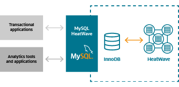
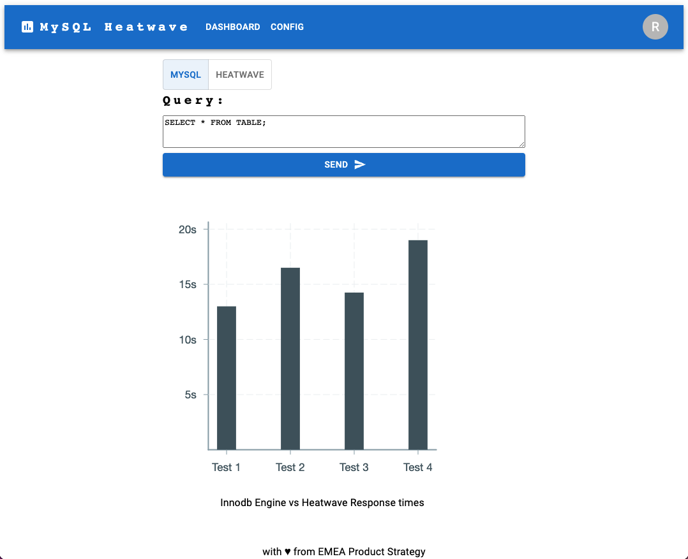

# MySQL and HeatWave for Health

This workshop is a hands-on experience to test the performance advantages and cost savings you can benefit from by using MySQL HeatWave.

You are going to run queries on a dataset of a fitness tracker. Run them with MySQL Innodb engine and then with HeatWave to speed up your analytical and ML queries.

## HeatWave Introduction

HeatWave—In-Memory Query Accelerator with Built-in ML.



Increases MySQL performance by orders of magnitude for analytics and mixed workloads. Eliminates the need for a separate analytics database, separate machine learning (ML) tools, and extract, transform, and load (ETL) processes.

## Workshop

- Lab 1: Introduction 
- Lab 2: Getting Started (Trial)
- Lab 3: UI deployment of MySQL and Heatwave
- Lab 4: Load fitness dataset
- Lab 5: Web deployment (Resource Manager)
- Lab 6: Expore benchmarking
- Lab 7: Data Science get started
- Lab 8: Clean up

Website Mock-up:


## Nice to have

- Performance competition
- Story on the data science (enhance dataset)
- Olympics dataset as alternative

## Requirements

- Active Oracle Cloud Account (with credits)

## TODO

- Import csv
- Deploy HeatWave
- Run Query without Heatwave
- Run Query with Heatwave
- Frontend
- Frontend Deployment
- Backend HeatWave on/off
- Backend Deployment


## Set Up

Clone this repository in OCI Cloud Shell:
```
git clone https://github.com/vmleon/mysql-heatwave-health.git
```

Change directory to the `mysql-heatwave-health`:
```
cd mysql-heatwave-health
```

Export an environment variable with the base directory:
```
export BASE_DIR=$(pwd)
```

## Deployment

Change directory to `deploy/terraform`:
```
cd $BASE_DIR/deploy/terraform
```

Use terraform variables template file to create your own `terraform.tfvars`:
```
cp terraform.tfvars.template terraform.tfvars
```

Edit the variables values with vim or your favorite editor:
```
vim terraform.tfvars
```

Initialize the terraform provider:
```
terraform init
```

Apply the infrastructure, based on the plan from the previous step:
```
terraform apply -auto-approve
```

Print MySQL password:
```
terraform output mysql_admin_password
```

Install MySQL Shell and dataset CSV files on the client:
```
ansible-playbook -i ./generated/client.ini ../ansible/client.yaml
```

## Import Dataset

```
cat .my.cnf
```

```
mysqlsh --user=USER --host=HOST
```

```
mysqlsh --file schema.js
```

```
\exit
```

## Benchmark HeatWave

XXX

## Clean Up

Destroy all the infrastructure:
```
terraform destroy -auto-approve
```