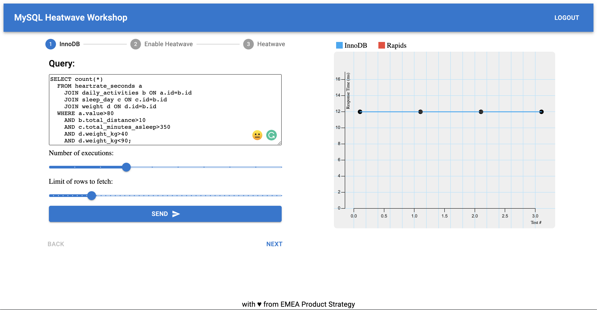

# MySQL and HeatWave for Health

This workshop is a hands-on experience to test the performance advantages and cost savings you can benefit from by using MySQL HeatWave.

You are going to run queries on a dataset of a fitness tracker. Run them with MySQL Innodb engine and then with HeatWave to speed up your analytical and ML queries.

## HeatWave Introduction

HeatWave—In-Memory Query Accelerator with Built-in ML.


Increases MySQL performance by orders of magnitude for analytics and mixed workloads. Eliminates the need for a separate analytics database, separate machine learning (ML) tools, and extract, transform, and load (ETL) processes.

## Workshop

- Lab 1: Introduction 
- Lab 2: Getting Started (Trial)
- Lab 3: UI deployment of MySQL and Heatwave
- Lab 4: Load fitness dataset
- Lab 5: Web deployment (Resource Manager)
- Lab 6: Explore benchmarking
- Lab 7: Heatwave ML
- Lab 8: Clean up

Website Mock-up:


## Nice to have

- Performance competition
- Story on the data science (enhance dataset)
- Olympics dataset as alternative?

## Requirements

- Active Oracle Cloud Account (with credits)
- Terraform
- OCI CLI

## TODO

- Deploy HeatWave
- Run Query with Heatwave
- HeatWave on/off


## Set Up

Clone this repository in OCI Cloud Shell:
```
git clone https://github.com/vmleon/mysql-heatwave-health.git
```

Change directory to the `mysql-heatwave-health`:
```
cd mysql-heatwave-health
```

Export an environment variable with the base directory:
```
export BASE_DIR=$(pwd)
```

## Build 

Change directory to the ``:
```
cd $BASE_DIR/src/web
```

Run the web build:
```
npm run build
```

## Deployment

Change directory to `deploy/terraform`:
```
cd $BASE_DIR/deploy/terraform
```

Use terraform variables template file to create your own `terraform.tfvars`:
```
cp terraform.tfvars.template terraform.tfvars
```

Edit the variables values with vim or your favorite editor:
```
vim terraform.tfvars
```

Initialize the terraform provider:
```
terraform init
```

Apply the infrastructure, based on the plan from the previous step:
```
terraform apply -auto-approve
```

Print MySQL password:
```
terraform output mysql_admin_password
```

Install MySQL Shell and dataset CSV files on the client:
```
ansible-playbook -i ./generated/client.ini ../ansible/client.yaml
```

## Explore with Mysql Shell

```
mysqlsh \
  --mx \
  --user=`cat mysql_user.txt` \
  --host=`cat mysql_host.txt` \
  --password=`cat mysql_password.txt` \
  --schema=fitbit
```

```
\q
```

## Benchmark HeatWave

The tables you intend to load must be InnoDB tables. You can manually convert tables to InnoDB using the following ALTER TABLE statement:

```
ALTER TABLE tbl_name ENGINE=InnoDB;
```

The tables you intend to load must be defined with a primary key. You can add a primary key using the following syntax:

```
ALTER TABLE tbl_name ADD PRIMARY KEY (column);
```

Load time is affected if the primary key contains more than one column, or if the primary key column is not an INTEGER column. The impact on MySQL performance during load, change propagation, and query processing depends on factors such as data properties, available resources (compute, memory, and network), and the rate of transaction processing on the MySQL DB System.

To exclude columns from loading into Heatwave:
```
CREATE TABLE orders (id INT, description BLOB NOT SECONDARY);
```

Add `RAPID` as secondary engine for tables:
```
ALTER TABLE orders SECONDARY_ENGINE = RAPID;
CREATE TABLE orders (id INT) SECONDARY_ENGINE = RAPID;
```

Load table to HeatWave:
```
ALTER TABLE orders SECONDARY_LOAD;
```

Alternatively, Auto Parallel Load
```
CALL sys.heatwave_load(JSON_ARRAY("fitbit"),NULL);
```

Monitoring Load Progress:
```
SELECT VARIABLE_VALUE
  FROM performance_schema.global_status
  WHERE VARIABLE_NAME = 'rapid_load_progress';
```

Checking Load Status

```
USE performance_schema;
```

```
SELECT NAME, LOAD_STATUS FROM rpd_tables,rpd_table_id
  WHERE rpd_tables.ID = rpd_table_id.ID;
```

`AVAIL_RPDGSTABSTATE` means the table is loaded.

Data changes on the MySQL DB System node are propagated to HeatWave in batch transactions. Change propagation is initiated as follows:
- Every 200ms.
- When the change propagation buffer reaches its 64MB capacity.
- When data updated by DML operations on the MySQL DB System are read by a subsequent HeatWave query.

Propagation status:
```
SELECT VARIABLE_VALUE FROM performance_schema.global_status WHERE VARIABLE_NAME = 'rapid_change_propagation_status';
```

`autocommit` must be enabled. If `autocommit` is disabled, queries are not offloaded and execution is performed on the MySQL DB System. To check the `autocommit` setting:
```
SHOW VARIABLES LIKE 'autocommit';
```

Before running a query, you can use `EXPLAIN` to determine if the query will be offloaded to HeatWave for processing. If so, the Extra column of `EXPLAIN` output shows: `Using secondary engine RAPID`.
```
EXPLAIN SELECT ...
```

To compare HeatWave query execution time with MySQL DB System execution time, disable the use_secondary_engine variable and run the query again to see how long it takes to run on the MySQL DB System.
```
SET SESSION use_secondary_engine=OFF;
```

Unload the table from HeatWave:
```
ALTER TABLE orders SECONDARY_UNLOAD;
```
## Clean Up

Destroy all the infrastructure:
```
terraform destroy -auto-approve
```