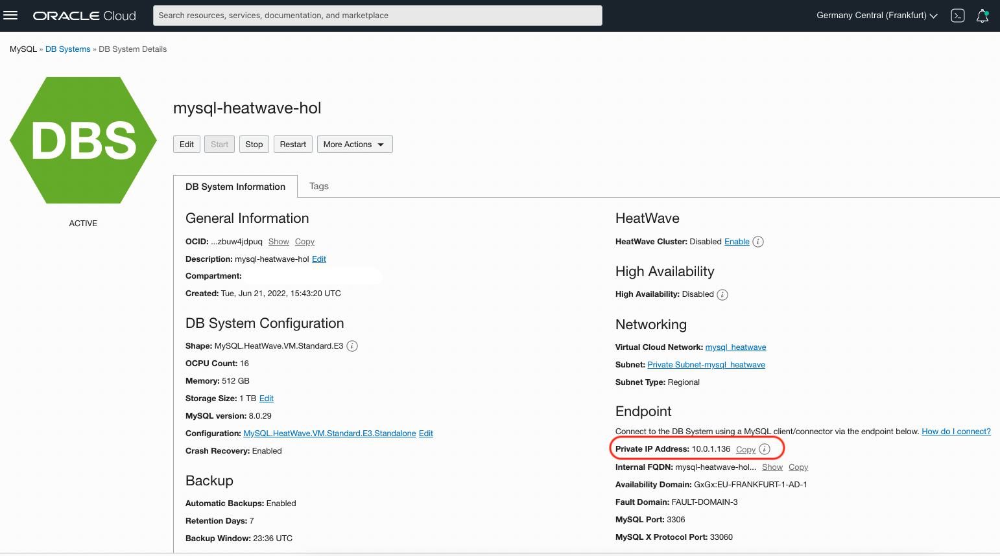
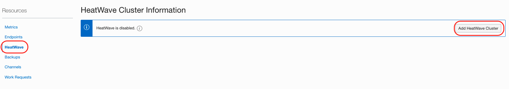
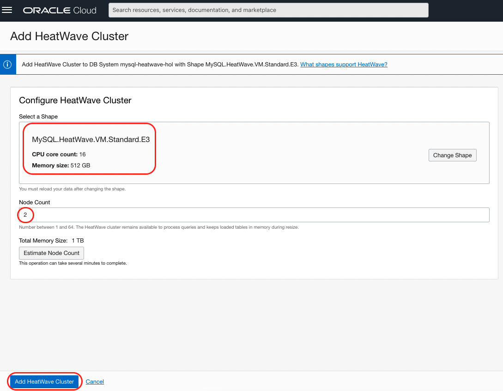
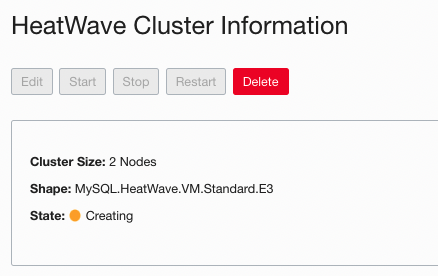
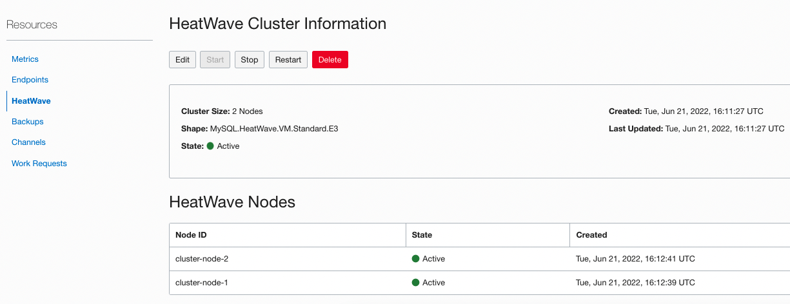

# Heatwave Enablement

## Introduction

In this lab we will enable Heatwave to get the Analytical engine for MySQL Database ready to get used.

The element that we will be creating is:

  - Enable Heatwave cluster. 

The DB System and HeatWave cluster must use the same shape, the shape defines the number of CPU cores, the amount of RAM, and so on. The size of the HeatWave cluster needed depends on tables and columns required to load, and the compression achieved in memory for this data. By enabling HeatWave you will deploy a standalone DB System characterized by a HeatWave-compatible shape (MySQL.HeatWave.VM.Standard.E3) and 1TB of data storage that will accelerate processing of analytic queries. For more information, check **[HeatWave Documentation](https://docs.oracle.com/en-us/iaas/mysql-database/doc/heatwave1.html#GUID-9401C69A-B379-48EB-B96C-56462C23E4FD)**. 

Estimated Time: 35 minutes

### Objectives

In this lab, you will:
  - Enable HeatWave Cluster to MySQL Database Service

### Prerequisites

-  Lab 1: Infrastructure Configuration completed.
  
## Task 1: Enable HeatWave Cluster to MySQL Database Service

1. We will need to wait for the DB System which you have just created until its status turns  **ACTIVE**, it would takes around 10 minutes.

  Once it is active you can take note of the **Private IP Address** of the MySQL DB System which we will use later in the workshop.

  

2. From the menu on the left bottom side select **HeatWave**, and click on the button **Add HeatWave Cluster** located on the right.
     
  

3. Check that **Shape** looks as per picture below, **MySQL.HeatWave.VM.Satandard.E3**, CPU Core Count: **16**, Memory Size: **512 GB**, otherwise change it.**Node Count** is set to **2**, and then click the button **Add HeatWave Cluster**.

  

3. You will be brought back to the main page where you can check for the creation status. After some seconds you should see the nodes in **Creating** status.
     
  

  After completion, the node status will switch to **Active** status. The process will take some time to be completed. You can go to the next Task in the meantime.

  

As a recap, in this lab we have enabled HeatWave cluster to MySQL Database Service.

Well done, you can now proceed to the next lab!

## Acknowledgements

- **Author** - Victor Martin - Technology Product Strategy Director, Priscila Iruela - Technology Product Strategy Director
- **Contributors** - XXX
- **Last Updated By/Date** - XXX