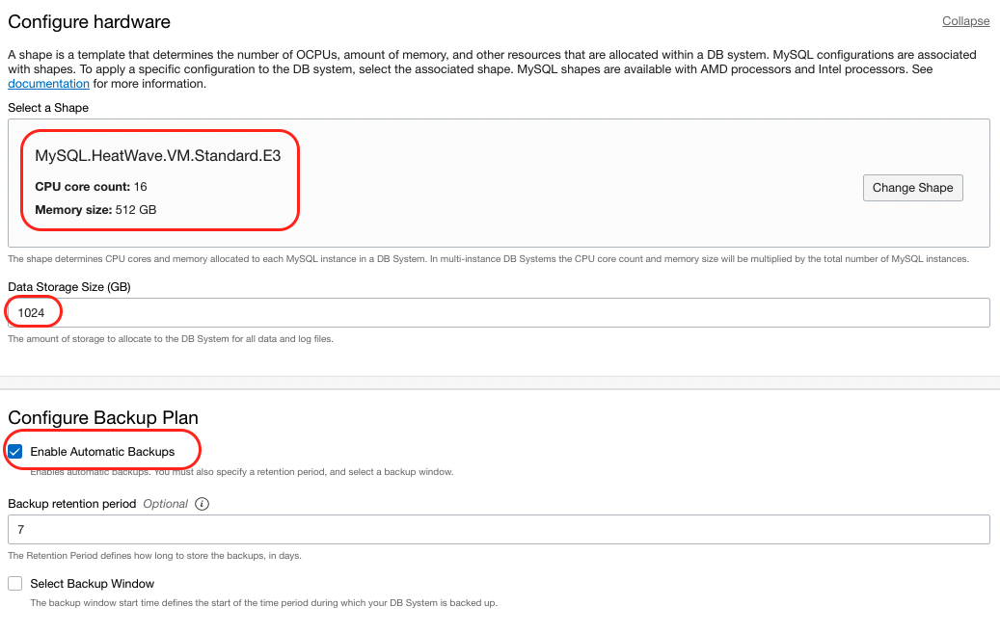

# Infrastructure Configuration

## Introduction

In this lab we will build the infrastructure that we will use to run the rest of the workshop. 

The two elements that we will be creating are:

  - Virtual Cloud Network which helps you define your own data center network topology inside the Oracle Cloud by defining some of the following components (Subnets, Route Tables, Security Lists, Gateways, etc.).
  - MySQL DB Service instance


Estimated Time: 35 minutes

### Objectives

In this lab, you will:
  -	Create a Virtual Cloud Network and allow traffic through MySQL Database Service port
  - Create an Instance of MySQL in the Cloud

### Prerequisites

- Oracle Free Trial Account.
  
## Task 1: Create a Virtual Cloud Network (VCN) and allow traffic through MySQL Database Service port

1. We are going to **create a network with a public subnet** (with access from the Internet) and a **private subnet** (no direct access from the Internet).

  This **network** layout is interesting to protect those services that don't need to be exposed to the Internet (living in the Private subnet) meanwhile other services and virtual machines with **direct access from the internet**, like Bastion hosts or Web Servers (living in the Public Subnet).

2. Go to **Menu**, **Networking** and then click **Virtual Cloud Networks**.

  

  > Note: If you have not picked a compartment, pick the **root** compartment for this Lab.
  >
  >

3. Click **Start VCN Wizard**.

  

4. Select **VCN with Internet Connectivity** and click **Start VCN Wizard**.

  

5. Change the **VCN name** and leave everything else as **default**. Click **Next**.

    - VCN Name: `mysql_heatwave`
    ```
    <copy>mysql_heatwave</copy>
    ```

  

6. Review all the details and click **Create**.

  

  The creation process takes few seconds. Confirm everything is created (green tick on all resources) before you continue.

7. Click **View Virtual Cloud Network**.

  

8. Go to your new **Private Subnet-mysql_heatwave**.

  

9. Click **Security List for Private Subnet-nature**.

  

  We need to open the ports for MySQL and MySQL X protocols: `3306` and `33060`.

10. Click **Add Ingress Rules** and fill the form with the following information:

  

  We are adding an **ingress rule** on those ports from the internal VCN CIDR `10.0.0.0/16`.

    - Source CIDR: `10.0.0.0/16`
    ```
    <copy>10.0.0.0/16</copy>
    ```
    - Destination Port Range: `3306,33060`
    ```
    <copy>3306,33060</copy>
    ```
    - Description: `MySQL and MySQL X Protocol`
    ```
    <copy>MySQL and MySQL X Protocol</copy>
    ```
    - Leave the rest of the fields with default values.

  And click **Add Ingress Rule** to confirm the values.

  

11. You can **confirm** the rules are added.

  


## Task 2: Create an Instance of MySQL in the Cloud

1. From the console main menu on the left side select **Databases >> DB Systems**.
    
  

2. It will bring you to the DB System creation page. Pick the **root** compartment for this Lab. Once done, click on **Create MySQL DB System**.

  

3. Start creating the DB System. Cross check again the compartment, **root**. Fill out the following information:

    - Name: **mysql-heatwave-hol**
      ```
      <copy>mysql-heatwave-hol</copy>
      ```
    - Description: (optional)  
    - Version: **HeatWave**
  
  

4. In the **Create Administrator Credentials** section enter the username and choose a password of your own, but make sure to note it as you will be using it later through the workshop:
    
    - username: **admin**
      ```
      <copy>admin</copy>
      ```

5. In the **Configure Networking** section make sure you select the VCN that we created on Task number 1 of this workshop, **`mysql-heatwave`**. For MySQL you will use a different subnet, the private one called **`Private Subnet-mysql-heatwave (Regional)`**.

  

6. Leave the default availability domain as it is, **AD-1** and proceed to the **Configure Hardware** section.
   
  

7. Confirm that in the **Configure Hardware** section, the selected shape is **MySQL.HeatWave.VM.Standard.E3**, CPU Core Count: **16**, Memory Size: **512 GB**, Data Storage Size: **1024**. In the **Configure Backup** section leave the default backup window of **7** days.

  

8. Scroll down and click on **Show Advanced Options**. 
    
  

9. Go to the **Networking** tab, and fill out the following information:
  - Hostname: **mysql-heatwave-hol** (same as DB System Name)
		```
		<copy> mysql-heatwave-hol</copy> 
		```
	- Check if the port configuration corresponds to the following, otherwise, change it to the following information:
      - MySQL Port: **3306**
      - MySQL X Protocol Port: **33060**

	- Once done, click the **Create** button.

	

10. The MySQL DB System will have **CREATING** state (as per picture below). 
    
  


As a recap we have created a VCN and added an additional Ingress rules to the Security list, and we also created MySQL Database instance which will be used to enable the HeatWave service later.

Well done, you can now proceed to the next lab!

## Acknowledgements

- **Author** - Victor Martin - Technology Product Strategy Director, Priscila Iruela - Technology Product Strategy Director
- **Contributors** - XXX
- **Last Updated By/Date** - XXX